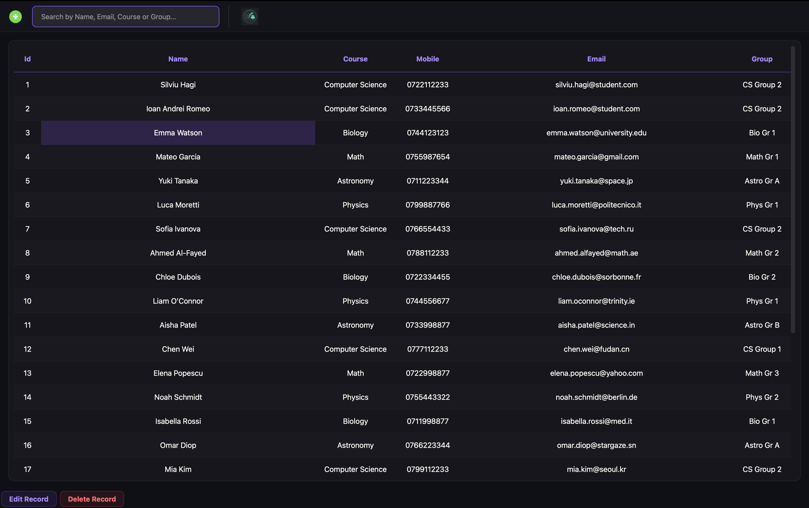
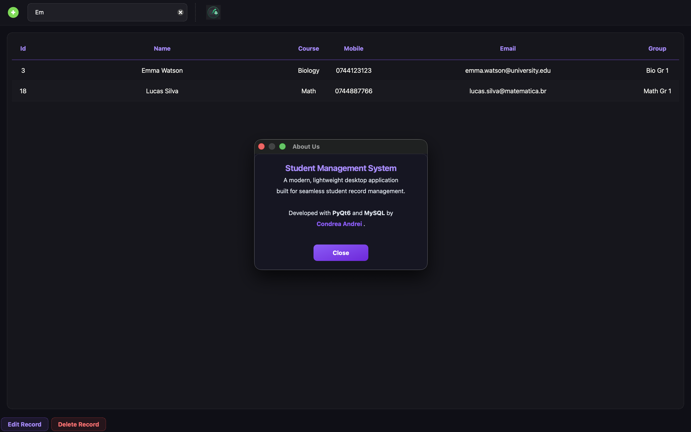
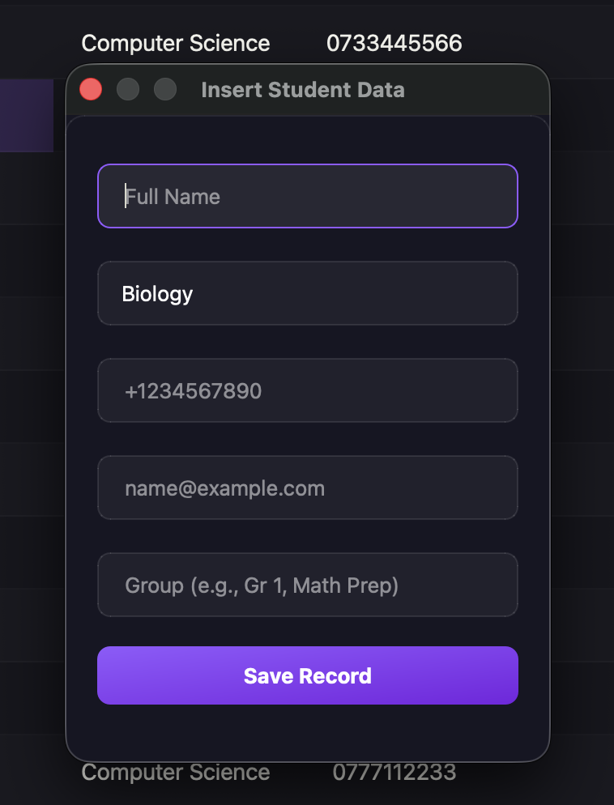

<div align="center">

  <h1>🎓 Student Management System</h1>

  <p>
    A modern <strong>desktop application</strong> for managing student records.<br />
    Built with <strong>PyQt6</strong> and <strong>MySQL</strong> — full CRUD, live search, CSV export, and a polished dark UI.
  </p>

  <p>
    
    
    
    
  </p>

</div>

<br />

---

## 📸 Screenshots

<div align="center">
  
  <br /><br />
  
  &nbsp;&nbsp;
  
</div>

<br />

---

## ✨ Features

* **📋 Full CRUD:** Add, edit, and delete student records through modal dialogs — each with live input validation.
* **🔍 Live Search:** Filter by name, email, course, or group in real time as you type — no button needed.
* **📤 CSV Export:** Export the current table view to a `.csv` file with a native save dialog.
* **✅ Input Validation:** Regex-based validation for phone numbers and emails — invalid inputs show a warning before any DB write.
* **🎨 Dark UI:** Full custom Qt stylesheet — glassmorphism-inspired dark theme with violet accents, hover effects, and alternating rows.
* **🔒 Env-Based Config:** Database credentials are loaded from a `.env` file — never hardcoded.

---

## 🧠 Under the Hood

### Architecture
UI and database logic are cleanly separated into two packages:

```
ui/       → MainWindow, dialogs, styles
database/ → DataBaseConnection (MySQL connector)
```

`MainWindow` never touches SQL directly — all queries go through `DataBaseConnection`, and dialogs call `self.parent().load_data()` to refresh the table after every change.

### Live Search
The search bar's `textChanged` signal is connected directly to `load_data()` — the table filters on every keystroke using a single `LIKE` query across all relevant columns:

```python
query = """
    SELECT * FROM students
    WHERE name LIKE %s OR email LIKE %s
       OR student_group LIKE %s OR course LIKE %s
"""
```

### Input Validation
All dialogs validate with `re.fullmatch()` before touching the database — no invalid records can be inserted or updated:

```python
if not re.fullmatch(r"\+?\d{7,15}", mobile):
    QMessageBox.warning(self, "Invalid Input", "Please enter a valid phone number.")
    return

if not re.fullmatch(r"^[a-zA-Z0-9_.+-]+@[a-zA-Z0-9-]+\.[a-zA-Z0-9-.]+$", email):
    QMessageBox.warning(self, "Invalid Input", "Please provide a valid email.")
    return
```

---

## 📁 Project Structure

```
Student-Management-System/
├── assets/
│   ├── add.png
│   ├── export.png
│   └── search.png
├── database/
│   ├── __init__.py
│   └── connection.py       # MySQL connection via python-dotenv
├── ui/
│   ├── __init__.py
│   ├── main_window.py      # MainWindow — table, toolbar, search, export
│   ├── dialogs.py          # Insert, Edit, Delete, About dialogs
│   └── styles.py           # Full Qt dark theme stylesheet
├── .env                    # Local credentials (not committed)
├── .env.example            # Template for environment variables
├── schema.sql              # Database & table creation script
├── main.py                 # App entry point
├── requirements.txt
└── README.md
```

---

## 🗄️ Database Setup

1. Open your MySQL client and run the provided schema:
    ```bash
    mysql -u root -p < schema.sql
    ```

    This creates the `school` database, the `students` table, and inserts 3 demo records:

    ```sql
    CREATE TABLE IF NOT EXISTS students (
        id            INT AUTO_INCREMENT PRIMARY KEY,
        name          VARCHAR(255) NOT NULL,
        course        VARCHAR(100) NOT NULL,
        mobile        VARCHAR(15)  NOT NULL,
        email         VARCHAR(100) NOT NULL,
        student_group VARCHAR(50)  NOT NULL
    );
    ```

2. Copy `.env.example` to `.env` and fill in your credentials:
    ```bash
    cp .env.example .env
    ```

    ```ini
    DB_HOST=localhost
    DB_USER=root
    DB_PASSWORD=your_password
    DB_NAME=school
    ```

---

## 🚀 Getting Started

1. **Clone the repository:**
    ```bash
    git clone https://github.com/AndrewTechTips/Student-Management-System.git
    cd Student-Management-System
    ```

2. **Install dependencies:**
    ```bash
    pip install -r requirements.txt
    ```

3. **Set up the database** *(see section above)*

4. **Run the app:**
    ```bash
    python main.py
    ```

---

## 📬 Contact

* **LinkedIn:** [Andrei Condrea](https://www.linkedin.com/in/andrei-condrea-b32148346)
* **Email:** condrea.andrey777@gmail.com

<p align="center">
  <i>"Built for those who manage hundreds of students — and want zero headaches." 🎓</i>
</p>